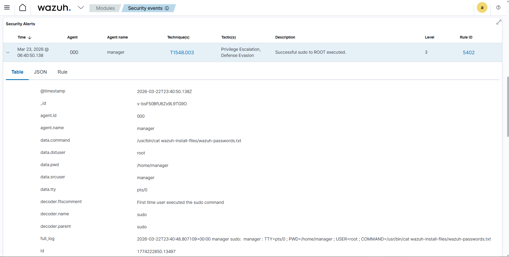
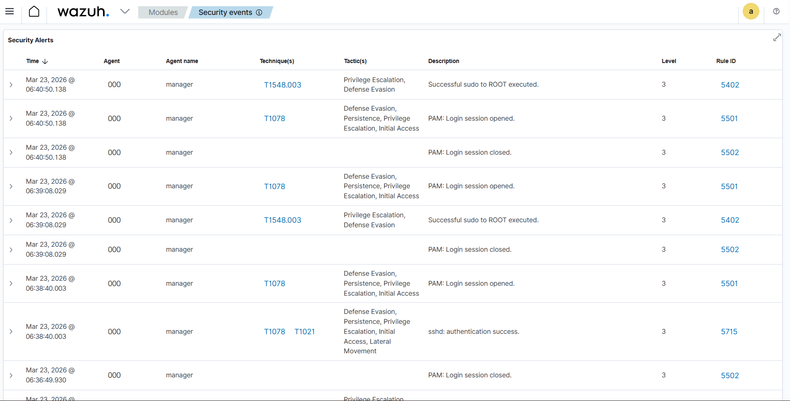

# 🛡️ Wazuh Alert Investigation: Privilege Escalation & SSH Brute Force

## 📌 Lab Setup
- Wazuh Manager (Ubuntu Server)
- Wazuh Agent (Ubuntu Server)
- VMware Workstation Lab

---
## 🔍  **Scenario 1: Privilege Escalation Detection**

**Alert:** Successful sudo to ROOT executed  

**Description:**  
A user executed a sudo command to gain root privileges and accessed a sensitive file.

**Analysis:**  
The command used:
`/usr/bin/cat wazuh-install-files/wazuh-passwords.txt`

This indicates access to sensitive credential data. The alert was triggered due to privilege escalation.

**Conclusion:**  
This activity was expected during lab setup but could indicate suspicious behavior in a production environment.

---

## 🔍 Scenario 2: SSH Brute Force Attack Simulation

**Attack Method:**
Simulated multiple failed SSH login attempts using a non-existent user.

**Command used:**
ssh scriptkiddo@localhost

**Detection:**
Wazuh generated alerts including:
- Failed login attempts  
- Invalid user access  
- Multiple authentication failures  

**Analysis:**  
Repeated login failures within a short time frame indicate brute force behavior (MITRE ATT&CK T1110).

**Conclusion:**  
This behavior is consistent with brute force attacks attempting unauthorized access.

---

## 🚨 Severity
- Medium to High (Level 5–10)

---

## 🛠️ Skills Demonstrated
- SIEM monitoring (Wazuh)  
- Log analysis  
- Threat detection  
- Incident investigation  
- Attack simulation  

---

## 📸 Screenshots

